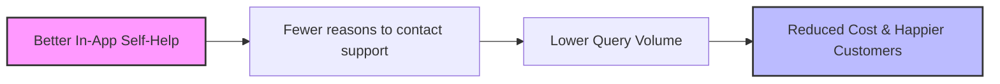

# Case 1: Swiggy

## Mapping Business Outcomes to Product Outcomes: Swiggy's Challenge with Customer Support Queries

Swiggy is India's leading food ordering and delivery platform. Since its launch in 2014, Swiggy has grown rapidly and currently has a presence in over 500 cities across India. Swiggy's mission is to provide a seamless food ordering and delivery experience to its customers.

However, Swiggy has been facing a challenge with the increasing number of customer support queries. This has led to a backlog of queries, increased wait times, and rising operational costs. The instinct might be to hire more support agents, but the product team's goal is to **prevent queries from happening at all** by designing the demand away.

---

## 1. Sizing the Support Team (Guesstimate)

To understand the scale of the operations, here is an estimation of the number of customer support agents Swiggy needs:

* **Daily Orders**: `2,000,000` (Assumed daily orders across India)
* **Query Rate**: `5%` of orders result in a customer support query $\rightarrow$ `100,000` queries/day
* **Agent Capacity**: 
  - $8\text{ hours/shift} = 480\text{ minutes}$
  - Avg. handling time per query $\approx 6\text{ minutes}$ (including wrap-up)
  - Queries handled per agent/shift $\approx 80\text{ queries}$
* **Buffer & Spikes**: `+30%` buffer added to account for breaks, lunch/dinner peak demand spikes, and leaves.

$$\text{Required Agents} = \frac{100,000\text{ queries/day}}{80\text{ queries/agent}} \times 1.30 \approx 1,625\text{ agents}$$

> [!NOTE]
> This model is dynamic. Changing the underlying assumptions (e.g., query rate or handling time) will immediately adjust the required headcount.

---

## 2. Product Roadmap & Outcome Mapping

By mapping customer pain points to product outcomes (changes in user behavior) and product outputs (features), we can deflect support queries:

| Why Customers Reach Out | Product Outcome (Desired Behavior) | Product Output (How We Deliver It) |
| :--- | :--- | :--- |
| **“Where is my order?”** | Customers track their own order, no contact needed | Live map tracking, accurate ETA, and proactive push delay alerts |
| **Wrong or missing items** | Customers report and resolve issues self-serve in-app | In-app "Report an Issue" flow with photo upload & instant automated resolution |
| **Refund & payment issues** | Customers obtain refunds without agent intervention | Automated instant refund processing for clear-cut system errors |
| **Can't find help / FAQs** | Customers self-serve answers before opening a chat | Contextual smart self-help portal & deflection chatbot |
| **Repeat contacts** | Fewer repeat queries for the same active ticket | Real-time status tracker and resolution progress shown in-app |

---

## 3. The Through-line

The strategic goal is to align product changes directly with business outcomes:

> [!IMPORTANT]
> **Key Takeaway**: Don't scale the support team to meet query demand; build product solutions that design the demand away.
