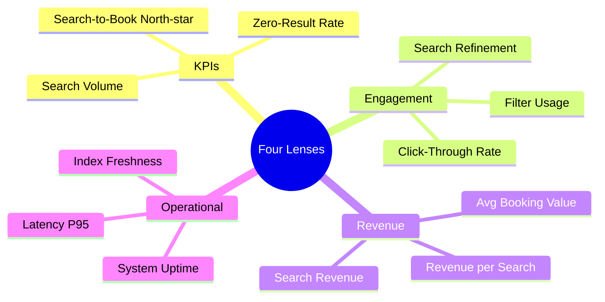

# Case 3: Wanderlust Travel

## Building a Metrics Dashboard for Wanderlust Travel

Prerana Joshi is a Product Manager working on the Search team at Wanderlust Travel, a leading online travel company. Offering a comprehensive range of travel services (flights, hotels, and vacation packages), the company has gained significant market share. 

However, the Search team previously lacked a centralized metrics dashboard. Data analysis was performed manually, and insights were scattered across various tools. This fragmented approach slowed down decision-making and hindered the team's ability to optimize the search experience.

To solve this, Prerana implemented a dashboard based on the **Four Lenses Framework**, transforming scattered data into actionable, real-time insights.

---

## 1. The Four Lenses Framework

To avoid blind spots (e.g., maximizing revenue while hurting system latency), search success is measured through four distinct lenses:

1. **Key Performance Indicators (KPIs)**: High-level indicators of search health and overall funnel success.
2. **User Engagement**: Behavioral signals inside the search journey that explain *why* the KPIs move.
3. **Revenue**: Commercial efficiency metrics tracking how effectively user intent is monetized.
4. **Operational**: Infrastructure health metrics ensuring search remains fast, stable, and accurate.

---

## 2. Search Metrics Dictionary

| Metric | Lens | Why It Matters / Target |
| :--- | :--- | :--- |
| **Search-to-Book Rate** | KPI | **North-Star Metric**: Percentage of search journeys ending in a successful booking. |
| **Zero-Result Rate** | KPI | Searches returning 0 results. High rates signal search inventory gaps or poor query parsing. |
| **Avg. Results per Query** | KPI | Breadth of options presented per query; affects choice overload vs. options. |
| **Search Volume** | KPI | Queries per week. Baseline health indicator for traffic. |
| **Click-Through Rate (CTR)** | Engagement | Percentage of searches where a user clicks a result. Measures result relevance. |
| **Search Refinement Rate** | Engagement | Percentage of users who re-search immediately. High rate indicates poor first-attempt results. |
| **Filter Usage Rate** | Engagement | Share of users who apply filters. Signals active, high-intent engagement. |
| **Mobile & Voice Share** | Engagement | Segment share of queries, helping prioritize mobile/voice product investment. |
| **Revenue per Search (RPS)** | Revenue | Direct connection between search queries and transaction revenue. |
| **Avg. Booking Value (ABV)** | Revenue | Transaction value, tracked across flights, hotels, and holiday packages. |
| **Upsell Attach Rate** | Revenue | Measures the attach rate of ancillaries (e.g., insurance, meals, baggage) during booking. |
| **Cost per Acquisition (CAC)** | Revenue | Marketing acquisition spend per booking; falls as search conversion rates improve. |
| **Search Latency P95** | Operational | Time to return results (95th percentile). Core SLA goal: `<500ms`. |
| **System Uptime** | Operational | Platform availability. Even minor downtime directly results in lost revenue. |
| **Search Index Freshness** | Operational | Time since inventory sync. Stale indices lead to price mismatch at checkout. |

---

## 3. Prototype Dashboard (Last 7 Days)

Here is the snapshot of the prototype dashboard built in Excel for the Product Lead:

### Core Performance Snapshot
* **Search Volume**: `4.2M` queries ($\Delta$ **▲ 8%** vs last week)
* **Search-to-Book Rate (North-Star)**: `3.8%` ($\Delta$ **▼ 0.3pp** vs last week)
* **Zero-Result Rate**: `6.2%` ($\Delta$ **▼ 1.1pp** improvement vs last week)
* **Click-Through Rate (CTR)**: `28.4%` ($\Delta$ **▲ 2.1pp** vs last week)

### Commercial & Infrastructure Health
* **Revenue per Search (RPS)**: `Rs. 4.12` ($\Delta$ **▲ Rs. 0.31** vs last week)
* **Search-Driven Revenue**: `Rs. 18.6M` ($\Delta$ **▲ 12%** vs last week)
* **Search Latency P95**: `320ms` ($\Delta$ **▼ 15ms** improvement vs last week)
* **System Uptime**: `99.94%` ($\Delta$ **▲ 0.02pp** vs last week)

---

## 4. Key Takeaways for the PM Team

> [!TIP]
> * **Metrics serve decisions, not dashboards**: Always ask, *"If this metric moves, what specific action will we take?"*
> * **Balance is key**: Focus on any single lens in isolation (like revenue) without tracking operational metrics (like latency) can lead to silent failures in user experience.
> * **Layout matters**: Present the North-Star metric prominently at the top-left, followed by leading indicators, and then operational safeguards.